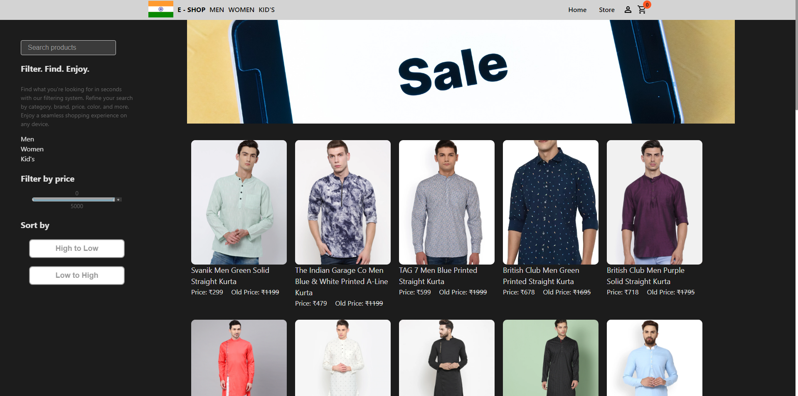

# E-Shop

 
<h1>Screenshot</h1> 
 
<h2>Home Page </h2> 
 
#1
 

 
#2

 
#3

 
#4

 
<h2>HMen Page </h2> 
 
#1

 
<h2>Women Page </h2> 
 
#1

 
<h2>Kid Page </h2>
 
#1

# E-Shop

This is a demo of an e-commerce website showcasing various features and functionality typically found in an online shop. The purpose of this project is to provide a visual representation of an e-commerce platform and to demonstrate the implementation of key features.

## Table of Contents
- [Features](#features)
- [Installation](#installation)
- [Usage](#usage)
- [Contributing](#contributing)

## Features

- **Product Catalog:** Browse through a wide range of products with details such as name, description, price, and discount.

- **Product Search:** Search for specific products using keywords or filters to quickly find what you're looking for.

- **Shopping Cart:** Add products to your cart, update quantities, and proceed to checkout.

## Installation

To run this project locally, follow these steps:

1. Clone the repository:
git clone [https://github.com/your-username/eshop-demo.git](https://github.com/harrybhai123/e-shop.git)

2. Navigate to the project directory:
cd eshop

3. Install the dependencies:
npm install

4. Start the development server:
npm start

5. Open your browser and visit `http://localhost:3000` to access the E-Shop demo.

## Usage
- Explore the various sections of the website, including the product page, shopping cart, Men, Women and Kid's pages.
- Add products to your cart, proceed to checkout, and simulate the payment process.

## Contributing
Contributions are welcome! If you encounter any issues or have suggestions for improvements, please submit a <a href="https://github.com/harrybhai123/e-shop/pulls">pull request</a>. 

<a href="e-shop-harry.netlify.app" > Click Me To See Website</a>
